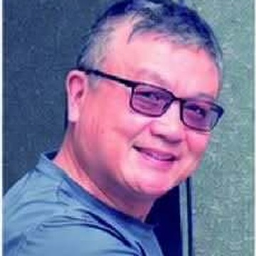
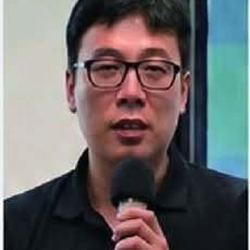
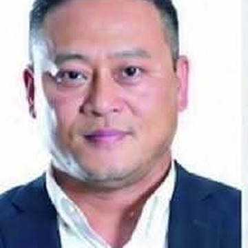

  
講者

  

    

      
      

        <strong>陳昭倫 教授</strong>
        第一場｜生態保育
      

    

    

      
      

        <strong>溫國彰 教授</strong>
        第二場｜資源管理
      

    

    

      
      

        <strong>蔡政良 教授</strong>
        第三場｜在地文化
      

    

  

  

    
主辦單位 依筆畫排序

    

      中央研究院生物多樣性研究中心珊瑚礁研究室
      臺北醫學大學通識教育中心
      國立台灣海洋大學海洋休閒產業暨遊艇發展中心
      東海大學生態與環境研究中心
      台灣海洋永續休閒採捕聯盟
      台灣自由潛水發展協會
    

  

